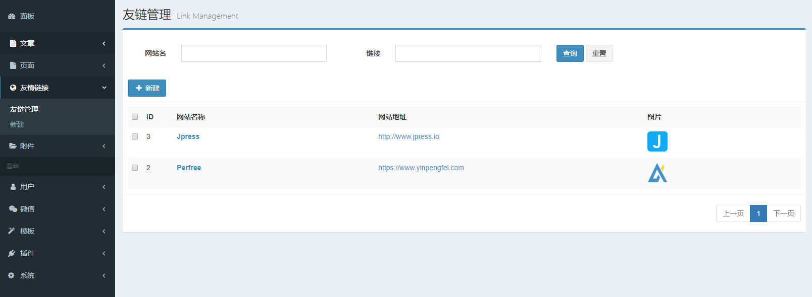
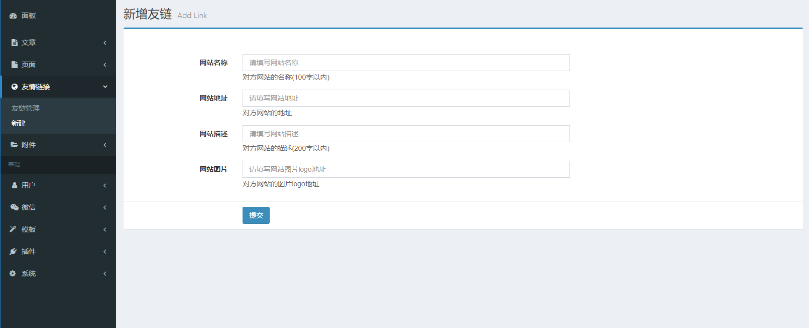

## 一个Jpress友情链接插件
使用方法(任意页面):
```
#perfreeLinks()
    #for(link : links)
	#(link.name)
	#(link.link)
	#(link.desc)
	#(link.imgUrl)
    #end
#end
```
name:网站名称

link:网站地址

desc:网站描述

imgUrl:网站logo

## 后台设置截图



